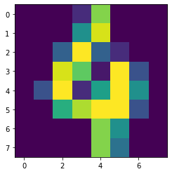

# KNN-手写体数字数据集


```python
import numpy as np
import matplotlib.pyplot as plt
from sklearn import datasets
from sklearn.neighbors import KNeighborsClassifier
```


```python
digits = datasets.load_digits()
X = digits.data
X.shape
```


    (1797, 64)


```python
y = digits.target
y.shape
```


    (1797,)


```python
one = X[100]
one = one.reshape(8, 8)
one
```


    array([[ 0.,  0.,  0.,  2., 13.,  0.,  0.,  0.],
           [ 0.,  0.,  0.,  8., 15.,  0.,  0.,  0.],
           [ 0.,  0.,  5., 16.,  5.,  2.,  0.,  0.],
           [ 0.,  0., 15., 12.,  1., 16.,  4.,  0.],
           [ 0.,  4., 16.,  2.,  9., 16.,  8.,  0.],
           [ 0.,  0., 10., 14., 16., 16.,  4.,  0.],
           [ 0.,  0.,  0.,  0., 13.,  8.,  0.,  0.],
           [ 0.,  0.,  0.,  0., 13.,  6.,  0.,  0.]])


```python
plt.imshow(one)
```


    <matplotlib.image.AxesImage at 0x1a203a9ad0>





# 分离训练测试集


```python
from sklearn.model_selection import train_test_split
train_test_split?
```


    Signature: train_test_split(*arrays, **options)
    Docstring:
    Split arrays or matrices into random train and test subsets
    
    Quick utility that wraps input validation and
    ``next(ShuffleSplit().split(X, y))`` and application to input data
    into a single call for splitting (and optionally subsampling) data in a
    oneliner.
    
    Read more in the :ref:`User Guide <cross_validation>`.
    
    Parameters
    ----------
    *arrays : sequence of indexables with same length / shape[0]
        Allowed inputs are lists, numpy arrays, scipy-sparse
        matrices or pandas dataframes.
    
    test_size : float, int or None, optional (default=None)
        If float, should be between 0.0 and 1.0 and represent the proportion
        of the dataset to include in the test split. If int, represents the
        absolute number of test samples. If None, the value is set to the
        complement of the train size. If ``train_size`` is also None, it will
        be set to 0.25.
    
    train_size : float, int, or None, (default=None)
        If float, should be between 0.0 and 1.0 and represent the
        proportion of the dataset to include in the train split. If
        int, represents the absolute number of train samples. If None,
        the value is automatically set to the complement of the test size.
    
    random_state : int, RandomState instance or None, optional (default=None)
        If int, random_state is the seed used by the random number generator;
        If RandomState instance, random_state is the random number generator;
        If None, the random number generator is the RandomState instance used
        by `np.random`.
    
    shuffle : boolean, optional (default=True)
        Whether or not to shuffle the data before splitting. If shuffle=False
        then stratify must be None.
    
    stratify : array-like or None (default=None)
        If not None, data is split in a stratified fashion, using this as
        the class labels.
    
    Returns
    -------
    splitting : list, length=2 * len(arrays)
        List containing train-test split of inputs.
    
        .. versionadded:: 0.16
            If the input is sparse, the output will be a
            ``scipy.sparse.csr_matrix``. Else, output type is the same as the
            input type.
    
    Examples
    --------
    >>> import numpy as np
    >>> from sklearn.model_selection import train_test_split
    >>> X, y = np.arange(10).reshape((5, 2)), range(5)
    >>> X
    array([[0, 1],
           [2, 3],
           [4, 5],
           [6, 7],
           [8, 9]])
    >>> list(y)
    [0, 1, 2, 3, 4]
    
    >>> X_train, X_test, y_train, y_test = train_test_split(
    ...     X, y, test_size=0.33, random_state=42)
    ...
    >>> X_train
    array([[4, 5],
           [0, 1],
           [6, 7]])
    >>> y_train
    [2, 0, 3]
    >>> X_test
    array([[2, 3],
           [8, 9]])
    >>> y_test
    [1, 4]
    
    >>> train_test_split(y, shuffle=False)
    [[0, 1, 2], [3, 4]]
    File:      /Applications/anaconda3/lib/python3.7/site-packages/sklearn/model_selection/_split.py
    Type:      function


```python
X_train, X_test, y_train, y_test = train_test_split(X, y, test_size=0.2)
print(X_train.shape)
print(y_train.shape)
print(X_test.shape)
print(y_test.shape)
```

    (1437, 64)
    (1437,)
    (360, 64)
    (360,)


# 测试


```python
KNNClf = KNeighborsClassifier(n_neighbors=3)
```


```python
KNNClf.fit(X_train, y_train)
```


    KNeighborsClassifier(algorithm='auto', leaf_size=30, metric='minkowski',
                         metric_params=None, n_jobs=None, n_neighbors=3, p=2,
                         weights='uniform')


```python
res = KNNClf.predict(X_test)
res
```


    array([3, 4, 8, 5, 5, 7, 0, 3, 1, 4, 7, 5, 5, 8, 0, 7, 4, 7, 1, 7, 9, 4,
           4, 7, 6, 1, 2, 9, 1, 3, 3, 3, 7, 0, 7, 0, 2, 8, 9, 1, 1, 5, 4, 8,
           9, 0, 4, 9, 4, 9, 7, 2, 7, 3, 3, 4, 1, 9, 9, 9, 0, 4, 0, 6, 1, 0,
           0, 3, 6, 2, 3, 2, 8, 5, 9, 3, 1, 1, 6, 9, 8, 1, 2, 3, 2, 6, 8, 8,
           4, 6, 8, 6, 3, 9, 2, 8, 3, 6, 5, 7, 1, 7, 3, 8, 8, 8, 0, 0, 9, 1,
           9, 8, 5, 1, 1, 0, 1, 6, 5, 1, 7, 6, 5, 7, 7, 2, 2, 7, 3, 1, 9, 5,
           9, 5, 5, 3, 8, 4, 9, 5, 4, 6, 0, 5, 4, 8, 6, 1, 2, 8, 0, 9, 0, 9,
           7, 9, 7, 0, 2, 8, 2, 4, 0, 6, 2, 6, 7, 5, 6, 3, 8, 8, 0, 3, 2, 0,
           6, 1, 0, 6, 0, 5, 9, 3, 3, 0, 4, 0, 4, 2, 4, 9, 0, 6, 7, 4, 6, 5,
           9, 7, 2, 2, 3, 3, 0, 3, 9, 4, 9, 8, 5, 6, 9, 0, 1, 3, 5, 0, 5, 1,
           6, 4, 6, 6, 6, 7, 9, 1, 0, 7, 6, 6, 7, 8, 0, 3, 8, 5, 6, 8, 1, 3,
           0, 3, 6, 0, 3, 5, 6, 7, 0, 6, 9, 7, 0, 0, 2, 1, 6, 6, 9, 1, 6, 9,
           8, 7, 0, 2, 5, 1, 8, 6, 4, 3, 8, 2, 9, 2, 8, 4, 6, 4, 8, 9, 3, 1,
           1, 5, 0, 7, 8, 2, 3, 8, 4, 7, 7, 7, 7, 9, 4, 1, 7, 0, 2, 9, 1, 8,
           2, 4, 1, 0, 7, 5, 6, 0, 7, 1, 1, 5, 7, 1, 1, 6, 5, 6, 2, 2, 3, 9,
           7, 5, 3, 1, 5, 9, 9, 2, 5, 1, 6, 8, 2, 2, 4, 2, 1, 0, 6, 1, 2, 9,
           7, 5, 3, 5, 6, 1, 8, 1])


```python
y_test
```


    array([3, 4, 8, 5, 5, 7, 0, 3, 1, 4, 7, 5, 5, 8, 0, 7, 4, 7, 1, 7, 9, 4,
           4, 7, 6, 1, 2, 9, 1, 3, 3, 3, 7, 0, 7, 0, 2, 8, 9, 1, 1, 5, 4, 8,
           9, 0, 4, 9, 4, 9, 7, 2, 7, 8, 3, 4, 1, 9, 9, 9, 0, 4, 0, 6, 1, 0,
           0, 3, 6, 2, 3, 2, 8, 5, 9, 3, 1, 1, 6, 9, 8, 1, 2, 3, 2, 6, 8, 8,
           4, 6, 8, 6, 3, 9, 2, 8, 3, 6, 5, 7, 1, 7, 9, 8, 8, 8, 0, 0, 9, 1,
           4, 8, 5, 1, 1, 0, 1, 6, 5, 1, 7, 6, 5, 7, 7, 2, 2, 7, 3, 1, 9, 5,
           9, 5, 5, 3, 8, 4, 9, 5, 4, 6, 0, 5, 4, 8, 6, 1, 2, 8, 0, 9, 0, 9,
           7, 9, 7, 0, 2, 8, 2, 4, 0, 6, 2, 6, 7, 5, 6, 3, 8, 8, 0, 3, 2, 0,
           6, 1, 0, 6, 0, 5, 9, 3, 3, 0, 4, 0, 4, 2, 4, 9, 0, 6, 7, 4, 6, 5,
           9, 7, 2, 2, 3, 3, 0, 3, 9, 4, 9, 8, 5, 6, 9, 0, 1, 3, 5, 0, 5, 1,
           6, 4, 6, 6, 6, 7, 9, 1, 0, 7, 6, 6, 7, 8, 0, 3, 8, 5, 6, 8, 1, 3,
           0, 3, 6, 0, 3, 5, 6, 7, 0, 6, 9, 7, 0, 0, 2, 1, 6, 6, 9, 1, 6, 9,
           8, 7, 0, 2, 5, 1, 8, 6, 4, 3, 8, 2, 9, 2, 8, 4, 6, 4, 8, 9, 3, 1,
           1, 5, 0, 7, 8, 2, 3, 8, 4, 7, 7, 7, 7, 7, 4, 1, 3, 0, 2, 9, 1, 8,
           2, 4, 1, 0, 7, 5, 6, 0, 7, 1, 1, 5, 7, 1, 1, 6, 5, 6, 2, 2, 3, 9,
           7, 5, 3, 1, 5, 9, 9, 2, 5, 1, 6, 8, 2, 2, 4, 2, 1, 0, 6, 1, 2, 9,
           7, 5, 3, 5, 6, 1, 8, 8])


```python
num = sum(res == y_test)
num
```


    354


```python
print('accuracy ', num / len(y_test))
```

    accuracy  0.9833333333333333


#### 使用sklearn中封装的计算精确度的方法


```python
from sklearn.metrics import accuracy_score as accuracy
```


```python
accuracy(res, y_test)
```


    0.9833333333333333


```python

```
