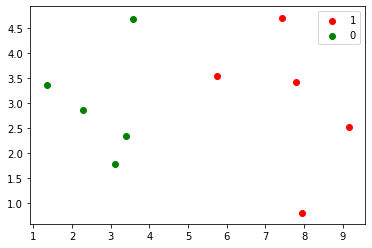
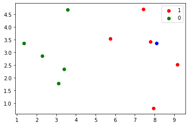

# 手动实现KNN


```python
import numpy as np
import matplotlib.pyplot as plt
```


```python
raw_data_x = [[3.393533211, 2.331273381],
              [3.110073483, 1.781539638],
              [1.343808831, 3.368360954],
              [3.582294042, 4.679179110],
              [2.280362439, 2.866990263],
              [7.423436942, 4.696522875],
              [5.745051997, 3.533989803],
              [9.172168622, 2.511101045],
              [7.792783481, 3.424088941],
              [7.939820817, 0.791637231]
             ]
raw_data_y = [0, 0, 0, 0, 0, 1, 1, 1, 1, 1]
```


```python
x_train = np.array(raw_data_x)
y_train = np.array(raw_data_y)
```


```python
x_train
```


    array([[3.39353321, 2.33127338],
           [3.11007348, 1.78153964],
           [1.34380883, 3.36836095],
           [3.58229404, 4.67917911],
           [2.28036244, 2.86699026],
           [7.42343694, 4.69652288],
           [5.745052  , 3.5339898 ],
           [9.17216862, 2.51110105],
           [7.79278348, 3.42408894],
           [7.93982082, 0.79163723]])


```python
y_train==1
```


    array([False, False, False, False, False,  True,  True,  True,  True,
            True])


```python
plt.scatter(x_train[y_train==1, 0], x_train[y_train==1, 1], color='r', label='1')
plt.scatter(x_train[y_train==0, 0], x_train[y_train==0, 1], color='g', label='0')
plt.legend()
```


    <matplotlib.legend.Legend at 0x122311ad0>





```python
x = np.array([8.093607318, 3.365731514])

plt.scatter(x_train[y_train==1, 0], x_train[y_train==1, 1], color='r', label='1')
plt.scatter(x_train[y_train==0, 0], x_train[y_train==0, 1], color='g', label='0')
plt.scatter(x[0], x[1], color='b')
plt.legend()
plt.show()
```





```python
import math
distance = []
```


```python
for each in x_train:
    d = math.sqrt(np.sum((each - x) ** 2))
    distance.append(d)
```


```python
distance
```


    [4.812566907609877,
     5.229270827235305,
     6.749798999160064,
     4.6986266144110695,
     5.83460014556857,
     1.4900114024329525,
     2.354574897431513,
     1.3761132675144652,
     0.3064319992975,
     2.5786840957478887]


```python
distances = [math.sqrt(np.sum((each - x) ** 2)) for each in x_train]
distances
```


    [4.812566907609877,
     5.229270827235305,
     6.749798999160064,
     4.6986266144110695,
     5.83460014556857,
     1.4900114024329525,
     2.354574897431513,
     1.3761132675144652,
     0.3064319992975,
     2.5786840957478887]


```python
nearest = np.argsort(distances)
nearest
```


    array([8, 7, 5, 6, 9, 3, 0, 1, 4, 2])


```python
k = 6
topK_y = [y_train[i] for i in nearest[:k]]
topK_y
```


    [1, 1, 1, 1, 1, 0]


```python
import collections
votes = collections.Counter(topK_y)
votes
```


    Counter({1: 5, 0: 1})


```python
votes.most_common(1)
```


    [(1, 5)]


```python
predict_y = votes.most_common(1)[0][0]
predict_y
```


    1


# scikit-learn实现KNN


```python
import numpy as np
from sklearn.neighbors import KNeighborsClassifier
```


```python
raw_data_x = [[3.393533211, 2.331273381],
              [3.110073483, 1.781539638],
              [1.343808831, 3.368360954],
              [3.582294042, 4.679179110],
              [2.280362439, 2.866990263],
              [7.423436942, 4.696522875],
              [5.745051997, 3.533989803],
              [9.172168622, 2.511101045],
              [7.792783481, 3.424088941],
              [7.939820817, 0.791637231]
             ]
raw_data_y = [0, 0, 0, 0, 0, 1, 1, 1, 1, 1]

x_train = np.array(raw_data_x)
y_train = np.array(raw_data_y)

target = np.array([8.093607318, 3.365731514])
```


```python
KNN_classifier = KNeighborsClassifier(n_neighbors=6)
```


```python
KNN_classifier.fit(x_train, y_train)
```


    KNeighborsClassifier(algorithm='auto', leaf_size=30, metric='minkowski',
                         metric_params=None, n_jobs=None, n_neighbors=6, p=2,
                         weights='uniform')


```python
target = x.reshape(1, -1)
print(target)
```

    [[8.09360732 3.36573151]]


```python
KNN_classifier.predict(target)
```


    array([1])


```python
res = KNN_classifier.predict(target)
res[0]
```


    1


