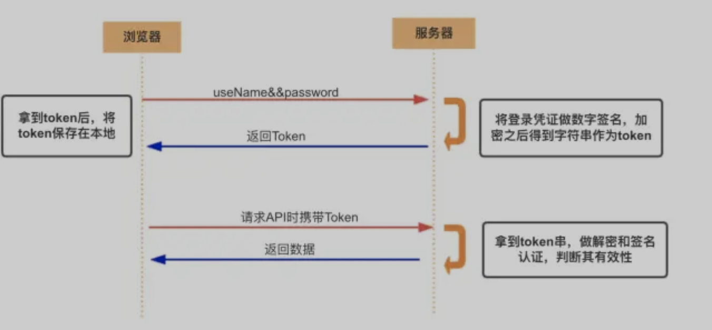
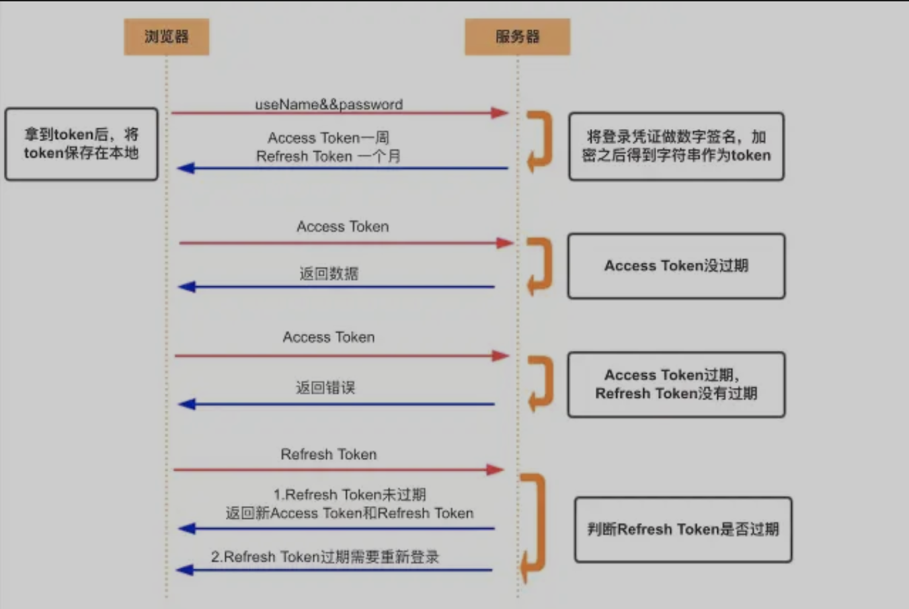
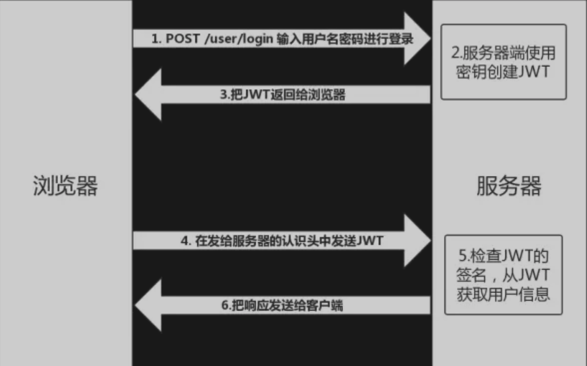

Cookie, Session, Token, JWT

# Authentication(认证)
认证当前的用户的身份

互联网中的认证
  - 用户名密码登陆
  - 邮箱发送登陆链接
  - 手机号接受验证码

# Authorization(授权)
用户权限

实现授权的方式
  - Cookie
  - Session
  - Token
  - OAuth

# Credentials(凭证)
**实现认证和授权的前提是需要一种媒介（证书）来标记访问者的身份。**

在互联网应用中，一般网站（如掘金）会有两种模式，游客模式和登录模式。游客模式下，可以正常浏览网站上面的文章，一旦想要点赞/收藏/分享文章，就需要登录或者注册账号。当用户登录成功后，服务器会给该用户使用的浏览器颁发一个令牌（token），这个令牌用来表明你的身份，每次浏览器发送请求时会带上这个令牌，就可以使用游客模式下无法使用的功能。

# Cookie
- HTTP 是无状态的协议（对于事务处理没有记忆能力，每次客户端和服务端会话完成时，服务端不会保存任何会话信息）：每个请求都是完全独立的，服务端无法确认当前访问者的身份信息，无法分辨上一次的请求发送者和这一次的发送者是不是同一个人。所以服务器与浏览器为了进行会话跟踪（知道是谁在访问我），就必须主动的去维护一个状态，这个状态用于告知服务端前后两个请求是否来自同一浏览器。而这个状态需要通过 cookie 或者 session 去实现。
- cookie 存储在客户端： cookie 是服务器发送到用户浏览器并保存在本地的一小块数据，它会在浏览器下次向同一服务器再发起请求时被携带并发送到服务器上。
- cookie 是不可跨域的： 每个 cookie 都会绑定单一的域名，无法在别的域名下获取使用，一级域名和二级域名之间是允许共享使用的（靠的是 domain）。

# Session
- Session是另一种记录服务器和客户端会话状态的机制。
- Session是基于Cookie实现的，Session存储在服务器端，SessionId会被存储到客户端的Cookie中。
- Session认证流程
  - 用户第一次请求服务器的时候，服务器根据用户提交的相关信息，创建对应的Session。
  - 请求返回时将此Session对应的唯一标识信息SessionId返回给浏览器。
  - 浏览器接受到服务器返回的SessionId信息后，会将此信息存入到Cookie中，同时Cookie记录此SessionId属于哪个域名。
  - 当用户第二次访问服务器的时候，请求会自动判断此域名下是否存在Cookie信息，如果存在自动将Cookie信息信息也发送到服务端，服务端会从Cookie中获取SessionId，再根据SessionId查找到对应的Session信息，如果没有找到说明用户没有登陆或登陆失效，如果找到Session证明用户已经登陆可执行后面操作。

根据以上流程可知，SessionID 是连接 Cookie 和 Session 的一道桥梁，大部分系统也是根据此原理来验证用户登录状态。

# Cookie和Session的区别
- **安全性：**Session比Cookie安全，Session是存储在服务端的，Cookie是存储在客户端的。
- **存取值的类型不同：**Cookie只支持存字符串数据，想要设置其他类型的数据，需要将其转换成字符串，Session可以存任意数据类型。
- **有效期不同：**Cookie可设置为长时间按保持，比如我们经常使用的默认登陆功能，Session一半失效时间较短，客户端关闭或Session超时都会失效。
- **存储大小不同：**单个Cookie保存的数据不能超过4K，Session可存储数据远高于Cookie，但是当访问量过多，会占用过多的服务器资源。

# Token(令牌)
## Access Token
- 访问资源接口（API）时所需要的资源凭证
- 简单Token的组成：uid(用户唯一的身份标识)、time(当前时间的时间戳)、sign（签名，token 的前几位以哈希算法压缩成的一定长度的十六进制字符串）
- 特点
  - 服务端无状态化、可扩展性好。
  - 支持移动端设备
  - 安全
  - 支持跨程序调用
- Token的身份验证流程  

  1. 客户端使用用户名跟密码请求登陆
  2. 服务端收到请求，去验证用户名与密码
  3. 验证成功后，服务端会签发一个Token并把这个Token发送到客户端
  4. 客户端收到Token后，会把它存储起来（Cookie, LocalStorage）
  5. 客户端每次向服务端请求资源的时候需要带着服务端签发的Token
  6. 服务端收到请求，然后去验证客户端请求里面带着的Token，如果验证成功，就向客户端返回请求的数据

- 每一次请求都需要携带Token，需要把Token放到HTTP的Header里
- 基于Token的用户认证是一种服务端无状态的认证方法，服务端不用存放Token数据。用解析Token的实践换取Session的存储空间，从而减轻服务器的压力，减少频繁的查询数据库
- Token完全由应用管理，所以可以避开同源策略

## Refresh Token

- Refresh Token是专用于刷新Access Token的Token。如果没有Refresh Token，也可以刷新Access Token，但每次刷新都要用户输入登陆用户名和和密码。有了Refresh Token，客户端直接用Refresh Token去更新Access Token。



- Access Token 的有效期比较短，当 Acesss Token 由于过期而失效时，使用 Refresh Token 就可以获取到新的 Token，如果 Refresh Token 也失效了，用户就只能重新登录了。
- Refresh Token 及过期时间是存储在服务器的数据库中，只有在申请新的 Acesss Token 时才会验证，不会对业务接口响应时间造成影响，也不需要向 Session 一样一直保持在内存中以应对大量的请求。

# Token和Session的区别

- Session 是一种记录服务器和客户端会话状态的机制，使服务端有状态化，可以记录会话信息。而 Token 是令牌，访问资源接口（API）时所需要的资源凭证。Token 使服务端无状态化，不会存储会话信息。
- Session 和 Token 并不矛盾，作为身份认证 Token 安全性比 Session 好，因为每一个请求都有签名还能防止监听以及重放攻击，而 Session 就必须依赖链路层来保障通讯安全了。如果你需要实现有状态的会话，仍然可以增加 Session 来在服务器端保存一些状态。
- 所谓 Session 认证只是简单的把 User 信息存储到 Session 里，因为 SessionID 的不可预测性，暂且认为是安全的。而 Token ，如果指的是 OAuth Token 或类似的机制的话，提供的是 认证 和 授权 ，认证是针对用户，授权是针对 App 。其目的是让某 App 有权利访问某用户的信息。这里的 Token 是唯一的。不可以转移到其它 App上，也不可以转到其它用户上。Session 只提供一种简单的认证，即只要有此 SessionID ，即认为有此 User 的全部权利。是需要严格保密的，这个数据应该只保存在站方，不应该共享给其它网站或者第三方 App。所以简单来说：如果你的用户数据可能需要和第三方共享，或者允许第三方调用 API 接口，用 Token 。如果永远只是自己的网站，自己的 App，用什么就无所谓了。

# JWT

- JSON Web Token（简称 JWT）是目前最流行的跨域认证解决方案。
- 是一种认证授权机制
- JWT 是为了在网络应用环境间传递声明而执行的一种基于 JSON 的开放标准（RFC 7519）。JWT 的声明一般被用来在身份提供者和服务提供者间传递被认证的用户身份信息，以便于从资源服务器获取资源。比如用在用户登录上。
- 可以使用 HMAC 算法或者是 RSA 的公/私秘钥对 JWT 进行签名。因为数字签名的存在，这些传递的信息是可信的。

## 原理

- JWT认证流程
  - 用户输入用户名/密码登录，服务端认证成功后，会返回给客户端一个 JWT
  - 客户端将 token 保存到本地（通常使用 localstorage，也可以使用 cookie）
  - 当用户希望访问一个受保护的路由或者资源的时候，需要请求头的 Authorization 字段中使用Bearer 模式添加 JWT，其内容看起来是下面这样`Authorization: Bearer <token>`
- 服务端的保护路由将会检查请求头 Authorization 中的 JWT 信息，如果合法，则允许用户的行为
- 因为 JWT 是自包含的（内部包含了一些会话信息），因此减少了需要查询数据库的需要
- 因为 JWT 并不使用 Cookie 的，所以你可以使用任何域名提供你的 API 服务而不需要担心跨域资源共享问题（CORS）
- 因为用户的状态不再存储在服务端的内存中，所以这是一种无状态的认证机制

## 使用方式
客户端收到服务器返回的 JWT，可以储存在 Cookie 里面，也可以储存在 localStorage。

**方法一**
- 当用户希望访问一个受保护的路由或者资源的时候，可以把它放在 Cookie 里面自动发送，但是这样不能跨域，所以更好的做法是放在 HTTP 请求头信息的 Authorization 字段里，使用 Bearer 模式添加 JWT。
```
GET /calendar/v1/events
Host: api.example.com
Authorization: Bearer <token>
```
  - 用户的状态不会存储在服务端的内存中，这是一种 无状态的认证机制
  - 服务端的保护路由将会检查请求头 Authorization 中的 JWT 信息，如果合法，则允许用户的行为。
  - 由于 JWT 是自包含的，因此减少了需要查询数据库的需要
  - JWT 的这些特性使得我们可以完全依赖其无状态的特性提供数据 API 服务，甚至是创建一个下载流服务。
  - 因为 JWT 并不使用 Cookie ，所以你可以使用任何域名提供你的 API 服务而不需要担心跨域资源共享问题（CORS）

**方法二**
- 跨域的时候，可以把 JWT 放在 POST 请求的数据体里。

**方法三**
- 通过URL传输。
`http://www.example.com/user?token=xxx`

# Token和JWT的区别

相同：
- 都是访问资源的令牌
- 都可以记录用户的信息
- 都是使服务端无状态化
- 都是只有验证成功后，客户端才能访问服务端上手保护的资源

区别：
- Token: 服务端验证客户端发送过来的 Token 时，还需要查询数据库获取用户信息，然后验证 Token 是否有效。
- JWT: 将 Token 和 Payload 加密后存储于客户端，服务端只需要使用密钥解密进行校验（校验也是 JWT 自己实现的）即可，不需要查询或者减少查询数据库，因为 JWT 自包含了用户信息和加密的数据。

# 常见的前后端鉴权方式
- Session-Cookie
- Token(JWT, SSO)
- OAuth2.0

# 问题

**使用Cookie时需要考虑的问题**

- 因为存储在客户端，容易被客户端篡改，使用前需要验证合法性
- 不要存储敏感数据，比如用户密码，账户余额
- 使用 httpOnly 在一定程度上提高安全性
- 尽量减少 cookie 的体积，能存储的数据量不能超过 4kb
- 设置正确的 domain 和 path，减少数据传输
- cookie 无法跨域
- 一个浏览器针对一个网站最多存 20 个Cookie，浏览器一般只允许存放 300 个Cookie
- 移动端对 cookie 的支持不是很好，而 session 需要基于 cookie 实现，所以移动端常用的是 token

**使用Session时需要考虑的问题**

- 将 session 存储在服务器里面，当用户同时在线量比较多时，这些 session 会占据较多的内存，需要在服务端定期的去清理过期的 session
- 当网站采用集群部署的时候，会遇到多台 web 服务器之间如何做 session 共享的问题。因为 session 是由单个服务器创建的，但是处理用户请求的服务器不一定是那个创建 session 的服务器，那么该服务器就无法拿到之前已经放入到 session 中的登录凭证之类的信息了。
- 当多个应用要共享 session 时，除了以上问题，还会遇到跨域问题，因为不同的应用可能部署的主机不一样，需要在各个应用做好 cookie 跨域的处理。
- sessionId 是存储在 cookie 中的，假如浏览器禁止 cookie 或不支持 cookie 怎么办？ 一般会把 sessionId 跟在 url 参数后面即重写 url，所以 session 不一定非得需要靠 cookie 实现
- 移动端对 cookie 的支持不是很好，而 session 需要基于 cookie 实现，所以移动端常用的是 token

**使用Token时需要考虑的问题**

- 如果你认为用数据库来存储 token 会导致查询时间太长，可以选择放在内存当中。比如 redis 很适合你对 token 查询的需求。
- token 完全由应用管理，所以它可以避开同源策略
- token 可以避免 CSRF 攻击(因为不需要 cookie 了)
- 移动端对 cookie 的支持不是很好，而 session 需要基于 cookie 实现，所以移动端常用的是 token

**使用JWT时需要考虑的问题**

- 因为 JWT 并不依赖 Cookie 的，所以你可以使用任何域名提供你的 API 服务而不需要担心跨域资源共享问题（CORS）
- JWT 默认是不加密，但也是可以加密的。生成原始 Token 以后，可以用密钥再加密一次。
- JWT 不加密的情况下，不能将秘密数据写入 JWT。
- JWT 不仅可以用于认证，也可以用于交换信息。有效使用 JWT，可以降低服务器查询数据库的次数。
- JWT 最大的优势是服务器不再需要存储 Session，使得服务器认证鉴权业务可以方便扩展。但这也是 JWT 最大的缺点：由于服务器不需要存储 Session 状态，因此使用过程中无法废弃某个 Token 或者更改 Token 的权限。也就是说一旦 JWT 签发了，到期之前就会始终有效，除非服务器部署额外的逻辑。
- JWT 本身包含了认证信息，一旦泄露，任何人都可以获得该令牌的所有权限。为了减少盗用，JWT的有效期应该设置得比较短。对于一些比较重要的权限，使用时应该再次对用户进行认证。
- JWT 适合一次性的命令认证，颁发一个有效期极短的 JWT，即使暴露了危险也很小，由于每次操作都会生成新的 JWT，因此也没必要保存 JWT，真正实现无状态。
- 为了减少盗用，JWT 不应该使用 HTTP 协议明码传输，要使用 HTTPS 协议传输。

**使用加密算法时需要考虑的问题**

- 绝不要以明文存储密码
- 永远使用 哈希算法 来处理密码，绝不要使用 Base64 或其他编码方式来存储密码，这和以明文存储密码是一样的，使用哈希，而不要使用编码。编码以及加密，都是双向的过程，而密码是保密的，应该只被它的所有者知道， 这个过程必须是单向的。哈希正是用于做这个的，从来没有解哈希这种说法， 但是编码就存在解码，加密就存在解密。
- 绝不要使用弱哈希或已被破解的哈希算法，像 MD5 或 SHA1 ，只使用强密码哈希算法。
- 绝不要以明文形式显示或发送密码，即使是对密码的所有者也应该这样。如果你需要 “忘记密码” 的功能，可以随机生成一个新的 一次性的（这点很重要）密码，然后把这个密码发送给用户。

**只要关闭浏览器，Session就消失了**
不对。对 session 来说，除非程序通知服务器删除一个 session，否则服务器会一直保留，程序一般都是在用户做 log off 的时候发个指令去删除 session。
然而浏览器从来不会主动在关闭之前通知服务器它将要关闭，因此服务器根本不会有机会知道浏览器已经关闭，之所以会有这种错觉，是大部分 session 机制都使用会话 cookie 来保存 session id，而关闭浏览器后这个 session id 就消失了，再次连接服务器时也就无法找到原来的 session。如果服务器设置的 cookie 被保存在硬盘上，或者使用某种手段改写浏览器发出的 HTTP 请求头，把原来的 session id 发送给服务器，则再次打开浏览器仍然能够打开原来的 session。
恰恰是由于关闭浏览器不会导致 session 被删除，迫使服务器为 session 设置了一个失效时间，当距离客户端上一次使用 session 的时间超过这个失效时间时，服务器就认为客户端已经停止了活动，才会把 session 删除以节省存储空间。


# 分布式下Session共享方案

1. Session复制

任何一个服务器上的 session 发生改变（增删改），该节点会把这个 session 的所有内容序列化，然后广播给所有其它节点，不管其他服务器需不需要 session ，以此来保证 session 同步

优点：可容错，各个服务器间Session能够实时响应。

缺点：会对网络负荷造成一定压力，如果 session 量大的话可能会造成网络堵塞，拖慢服务器性能。

1. 粘性Session/IP绑定策略

采用 Ngnix 中的 ip_hash 机制，将某个 ip的所有请求都定向到同一台服务器上，即将用户与服务器绑定。 用户第一次请求时，负载均衡器将用户的请求转发到了 A 服务器上，如果负载均衡器设置了粘性 session 的话，那么用户以后的每次请求都会转发到 A 服务器上，相当于把用户和 A 服务器粘到了一块，这就是粘性 session 机制。

优点：简单，不需要对Session做任何个处理。

缺点：缺乏容错性，如果当前访问的服务器发生故障，用户被转移到第二个服务器上时，他的 session 信息都将失效。

3. Session共享（常用）

- 使用分布式缓存方案比如 Memcached 、Redis 来缓存 session，但是要求 Memcached 或 Redis 必须是集群
- 把 session 放到 Redis 中存储，虽然架构上变得复杂，并且需要多访问一次 Redis ，但是这种方案带来的好处也是很大的：
  - 实现了 session 共享；
  - 可以水平扩展（增加 Redis 服务器）；
  - 服务器重启 session 不丢失（不过也要注意 session 在 Redis 中的刷新/失效机制）；
  - 不仅可以跨服务器 session 共享，甚至可以跨平台（例如网页端和 APP 端）

4. Session持久化

将 session 存储到数据库中，保证 session 的持久化

优点：服务器出现问题，session 不会丢失

缺点：如果网站的访问量很大，把 session 存储到数据库中，会对数据库造成很大压力，还需要增加额外的开销维护数据库。